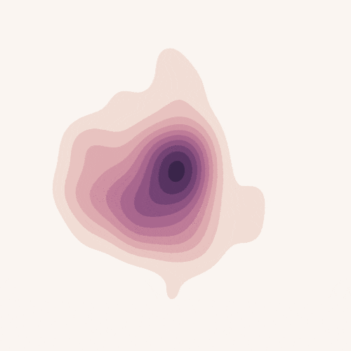

# gif_animations

GIF animations created in Python

|  |  |
|-|-|
|  |  |

## Dependencies

* [NumPy](http://www.numpy.org/) (numerical operations)
* [matplotlib](http://matplotlib.org/) (graphical representation)
* [seaborn](https://seaborn.pydata.org/) (statistical data visualization)
* [ImageMagick](http://www.imagemagick.org/) (image processing, GIF creation)
