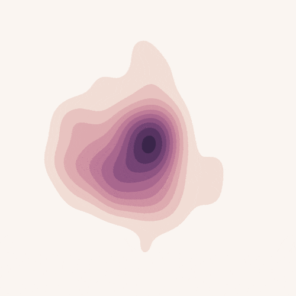
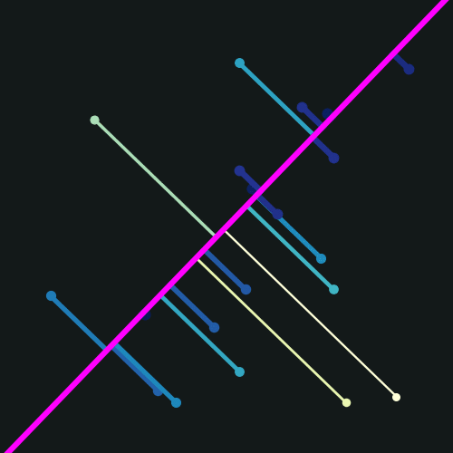

# gif_animations

GIF animations created in Python

|  |  |
|-|-|
|  |  |
|  |  |


## Dependencies

* Python packages

    * [NumPy](http://www.numpy.org/) - numerical operations
    * [matplotlib](http://matplotlib.org/) - graphical representation
    * [seaborn](https://seaborn.pydata.org/) - statistical data visualization
    * [pillow](https://python-pillow.org/) - image operations
    * [tqdm](https://tqdm.github.io/) - progress bar

<!-- -->

    conda create -n gif_animations python=3.7.0 numpy=1.15.4 matplotlib=3.0.2 seaborn=0.9.0 pillow=5.3.0 tqdm=4.28.1

* Command-line utilities

    * [ImageMagick](http://www.imagemagick.org/) - image processing, GIF creation


## Usage

```bash
python main.py
```
